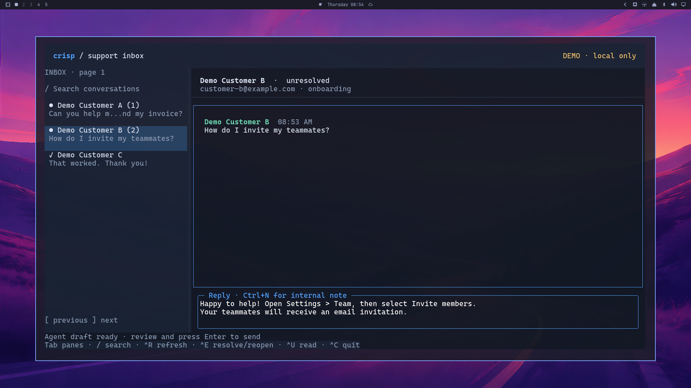

# crisp-tui

[](https://github.com/solcreek/crisp-tui/actions/workflows/ci.yml)
[](https://www.npmjs.com/package/crisp-tui)
[](LICENSE)
[](https://nodejs.org)

Crisp support inbox built with OpenTUI, SolidJS and Bun. People use the TUI;
agents use JSON commands and can prepare drafts in the same running screen.
[crispctl](https://github.com/solcreek/crisp-cli) v0.3.1 provides all REST and RTM
access. Both profile-based and 1Password sessions use its JSON interface;
this project has no separate HTTP or Socket.IO implementation.



Running on Omarchy with the Tokyo Night theme. The agent-prepared draft is ready
for human review; all contacts and messages shown are demo data.

## Install

Requires Node.js 20 or newer on macOS or Linux (glibc), on arm64 or x64.
**Bun is not required for npm/npx users.** npm installs the matching precompiled
executable, including the Bun runtime and OpenTUI renderer, automatically.
Windows and musl/Alpine are not currently supported.

Try the demo without a global installation:

```sh
npx crisp-tui --demo
```

Or install the command:

```sh
npm install -g crisp-tui
crisp-tui --demo
```

For a Crisp workspace, use `crisp-tui --read-only --profile sandbox --poll 0`
with a crispctl profile configured, or `crisp-tui live --item 'Crisp development'` with
1Password. `crisp-tui check --item 'Crisp development'` runs a bounded read-only
connection check. Add `--rtm-timeout 60` to require RTM authentication and an
actual event within 60 seconds. The npm package includes crispctl as a dependency.
The following `bun run` examples are for a source checkout.
Keep npm optional dependencies enabled; they carry the platform executable.
Installation requires no lifecycle scripts or first-run download.

## Run from source

Requires Bun 1.4.2 or newer on macOS or Linux. Demo mode needs no credentials.

```sh
git clone https://github.com/solcreek/crisp-tui.git
cd crisp-tui
bun install
bun run demo
```

Demo mode is explicit, in-memory, and never contacts Crisp. In another terminal:

```sh
bun run src/index.ts ctl state
bun run src/index.ts ctl goto session_demo_2
bun run src/index.ts ctl draft session_demo_2 'Let me help you check your settings.'
bun run src/index.ts ctl screen
```

The draft appears in the composer. Review it and press Enter to send. Demo
messages and drafts disappear on exit. Live mode never falls back to demo data.

## Read real data with 1Password

With `op` connected to the unlocked 1Password desktop app, create an item with
`API Identifier`, `API Key` and `website_id` fields. Choose its name explicitly:

```sh
bun run live:check --item 'Crisp development'       # connection + rendering check
bun run live:readonly --item 'Crisp development'    # interactive read-only TUI
```

`--website UUID` optionally overrides the item's website ID.
The credential fields are passed to crispctl through the child environment; no
config file, token file or customer-data capture is written. Errors omit raw
API response bodies and headers. The check prints website ID, counts,
message types and command names, without customer names or message text.

The session passes both `--read-only` and `CRISPCTL_READ_ONLY=1` to crispctl.
Its REST layer rejects non-GET/HEAD requests, and its listener only subscribes to
events. The TUI adapter also rejects
reply/note, resolve/reopen and mark-read before any HTTP request. The TUI displays
`READ ONLY` and hides its composer; agent drafts are disabled too. Automatic
polling is off in this mode: RTM events trigger refreshes, and Ctrl+R refreshes
manually. Opening a conversation does not mark it read.

`live:check` normally uses three REST commands: the first conversation page,
details of the first conversation, and its messages (one if the inbox is empty).
With `--rtm-timeout N`, it additionally listens until an event is received or the
deadline expires. It never sends a test message to generate that event.

For a crispctl-backed TUI, the same client/UI protection is available as:

```sh
bun run dev --read-only --profile sandbox --poll 0
```

The flag applies to that TUI instance. The independent `cli` bridge retains
crispctl's own capabilities. To control the 1Password TUI, use `ctl` with
`--profile onepassword-readonly --website UUID` (or the same
`CRISP_TUI_SOCKET` override).

## Website token setup

This TUI uses **website tokens**. As specified in the
[Crisp website token documentation](https://docs.crisp.chat/guides/rest-api/authentication/website-token/),
requests use Basic auth with `identifier:key` and `X-Crisp-Tier: website`.
The token belongs to one workspace. `crispctl` supplies these headers; this
project never includes the secret in UI state or stores a second copy.

This source checkout uses crispctl v0.3.1. To configure it separately on PATH:

```sh
npm install -g crispctl@0.3.1
```

Alternatively, build [crisp-cli from source](https://github.com/solcreek/crisp-cli#install)
in an adjacent checkout. For the read/write workflow below, configure a sandbox
profile using environment variables in your shell. Use a development workspace
for write testing, or the GET-only workflow above when inspecting real data.

```sh
export CRISP_IDENTIFIER='your-website-token-identifier'
export CRISP_KEY='your-website-token-key'
export CRISP_WEBSITE_ID='your-sandbox-website-id'
export CRISP_TIER=website

bun run src/index.ts cli auth set --profile sandbox
bun run dev --profile sandbox
```

The TUI defaults to `sandbox` (or `CRISPCTL_PROFILE`) and checks `auth show`
before starting. This is a local configuration check, not an API authentication
probe. It requires `tier=website`, identifier, key and website ID. An API error
appears in the status bar. The active website ID is visible in the header.

All crispctl config and environment precedence still applies, including
`CRISPCTL_CONFIG` and `CRISPCTL_*` credential overrides. `--website ID` is forwarded
to crispctl. Select the same `--profile` / `--website` when issuing `ctl` commands.

Executable lookup: `CRISPCTL_BIN` (one executable path, not a shell command),
then the npm launcher's bundled crispctl dependency, then the dependency resolved
from a source checkout, then `crispctl` on PATH, then
`../crisp-cli/dist/index.js` relative to this source
checkout. The last option requires Node. A compiled TUI should use PATH or
`CRISPCTL_BIN`. Credentials stay in the subprocess environment/config; commands
are spawned as argument arrays, never shell strings.

## Human workflow

The inbox supports paged conversations, server-side search, messages, text and
file-link display, replies, internal notes, resolve/reopen and explicit mark read.
Opening or polling a conversation does not mark it read. Drafts and reply/note
mode are kept separately for each conversation during this process.

| Key | Action |
| --- | --- |
| Tab / Shift+Tab | Cycle inbox, messages, composer |
| ↑↓ / j k | Select inbox row or scroll messages |
| Enter in inbox | Open conversation |
| Click inbox row | Open conversation |
| / in inbox/messages | Search; Enter submits; empty search returns to all |
| [ / ] in inbox/messages | Previous / next inbox page |
| Enter in composer | Send reply or internal note |
| Shift+Enter / Alt+Enter / Ctrl+J | Newline |
| Ctrl+N | Toggle reply / internal note |
| Ctrl+E | Resolve / reopen active conversation |
| Ctrl+U | Mark active conversation read |
| Ctrl+R | Refresh inbox and active conversation |
| Esc | Focus inbox |
| Ctrl+C | Quit |

A failed send keeps the draft; writes are never retried automatically. A timeout
can leave the send outcome unknown, so refresh before resending. Once a send is
acknowledged, a failed follow-up refresh does not restore the draft.
One-shot crispctl calls have a 30-second deadline; 1Password reads have a
60-second deadline. Partial output from a timed-out process is discarded.

## Agent workflow

Direct API operations work without a TUI. This is a verbatim bridge to crispctl;
pass its profile and `--json` flags explicitly:

```sh
bun run src/index.ts cli conversations list --profile sandbox --json
bun run src/index.ts cli messages list SESSION --profile sandbox --json
bun run src/index.ts cli reply SESSION --text 'Hello!' --profile sandbox --json
bun run src/index.ts cli assign SESSION --user OPERATOR_ID --profile sandbox --json
bun run src/index.ts cli segments SESSION --set billing,followup --profile sandbox --json
```

All other crispctl commands are available through `cli`, including people,
operators, resolve and reopen. Direct write commands act immediately.

The control commands work against the running TUI:

```sh
bun run src/index.ts ctl state
bun run src/index.ts ctl conversations
bun run src/index.ts ctl messages
bun run src/index.ts ctl goto SESSION
bun run src/index.ts ctl draft SESSION 'Proposed reply'
bun run src/index.ts ctl draft SESSION 'Internal context' --note
bun run src/index.ts ctl draft SESSION 'Revised draft' --replace
bun run src/index.ts ctl refresh
bun run src/index.ts ctl screen
```

`state` includes protocol version, source, current page/query, selected session,
conversation-loading state, active conversation,
loaded messages, per-session drafts and status. `messages` and `conversations`
return the currently loaded page, without an API call. `screen` is a semantic
text view of the loaded content, not an exact terminal screenshot. All other
successful control results are JSON; errors are JSON on stderr. Exit codes are
0 success, 1 operation error, 2 usage error, 3 no running TUI. `cli` preserves
crispctl's own output and exit code.

`draft` never sends or replaces an existing nonempty draft without `--replace`.
It switches to the target conversation and focuses the composer. There is no
control-socket send method; direct automated writes belong to crispctl.

### Control protocol

Unix socket in `/tmp/crisp-tui-<uid>/<profile-and-website-hash>.sock`.
Directory mode 0700, socket mode 0600. One TUI per socket; stale sockets are
recovered. Override with `CRISP_TUI_SOCKET` in both processes, using a
private parent directory. Demo and live share the selected profile socket, so
inspect `state.source` before acting. Processes using different config files
under the same profile name should use different socket overrides.

One newline-delimited JSON request per connection:

```json
{"id":1,"method":"draft","params":{"session":"session_demo_1","text":"Hello","note":false}}
```

Response: `{"id":1,"ok":true,"result":…}` or
`{"id":1,"ok":false,"error":"…"}`. Methods match `ctl` verbs. Unknown parameters
and invalid types are rejected. Screen-changing agent requests are serialized;
local snapshots (`state`, `screen`, `conversations`, `messages`) remain available
while a refresh or navigation waits on the API. CLI syntax, parameter validation
and command permissions are defined together in `src/commands.ts`.
No TCP server, daemon or MCP server is started.

## Refresh and current boundaries

The TUI starts `crispctl listen --json --read-only` and subscribes to message
send/receive/update/removal and conversation-state events. The header shows
`RTM live`, connecting, reconnecting or error. Crispctl handles endpoint discovery,
Socket.IO authentication and reconnects. The TUI coalesces event bursts into REST
refreshes, at most once every five seconds, and refreshes after authentication to
reconcile changes missed during a disconnected interval. This is event-triggered
REST reconciliation, not a local cache of every event.

Profile-based sessions also poll every 60 seconds by default. `--poll 0` disables
that periodic polling; it does not disable RTM. `--poll N` accepts at least 30
seconds. Polling failures back off exponentially to 15 minutes. A normal refresh
makes three REST requests. A quiet TUI polling every 60 seconds uses approximately
4,320 requests/day, with additional calls for RTM-triggered refreshes, searches
and writes. Consider this alongside the website token's documented daily quota.

Conversation history is the latest page exposed by crispctl; there is no older
message pagination, background daemon, push notifications, attachment upload or
preview, persisted drafts, or MCP in this first version. Assignment and segments
are available via the CLI bridge. The default tests use demo data, isolated
subprocesses and local sockets; they never read 1Password or contact Crisp.
Contract tests run the installed crispctl against an in-memory HTTP interceptor
with external network access disabled.
Real read-only checks are separate, explicitly invoked commands.

## Verification and binary

```sh
bun run typecheck
bun run build
bun run test:coverage
bun run test:package
./dist/crisp-tui-darwin-arm64 --demo  # filename follows OS / architecture
```

The standalone binary embeds Bun and the TUI renderer and needs crispctl on PATH
or `CRISPCTL_BIN`. The npm package includes crispctl and its platform executable;
only Node.js is needed on PATH. Bun 1.4.2 is a development/build requirement.
Tests exercise the UI with OpenTUI's
headless renderer, send failures, concurrent navigation, draft isolation,
polling/RTM cleanup, subprocess argument handling and the Unix control protocol.
CI checks source and compiled PTY workflows, then packs and installs the npm
artifacts outside the checkout and runs their PTY workflows with Bun absent from
PATH. A local test registry lets real `npm exec`/`npx` install the root package
and choose the correct platform dependency automatically. Both installed and
npx workflows exercise TUI startup, agent drafts, human send, shutdown and the
crispctl bridge. The package check downloads dependencies from npm; Crisp API
access is not required. CI runs on macOS/Linux arm64/x64 with Node.js 20 or 24.

Coverage excludes test fixtures/helpers, checks for missing source files, and
enforces overall 90% line and function thresholds from LCOV counts. CI uploads
`coverage/lcov.info` for each platform. The report measures code executed within
the test process; PTY subprocess coverage
(including the thin `src/index.ts` entrypoint) is not merged into that percentage.
The subprocess tests independently verify the executable behavior.

### Publishing platform packages

All five package versions must match. `bun run build:package` compiles and stages
the host platform under `packages/<os>-<arch>/bin/`. `bun run test:package` produces
verified tarballs in `dist/npm/`. CI uploads them as `npm-<os>-<arch>` artifacts.

Tag releases use `.github/workflows/publish.yml` and npm trusted publishing
(OIDC); no npm token is stored in GitHub. The workflow checks the tag against
`package.json`, runs the complete four-platform CI without restored caches, and
publishes its verified artifacts. Platform packages must become publicly
available before the launcher is published. Registry integrity checks prevent
overwriting or silently accepting an unrelated existing version.

Configure each package once with npm 11.15.0 or newer, a logged-in maintainer
account and 2FA:

```sh
for package in crisp-tui crisp-tui-darwin-arm64 crisp-tui-darwin-x64 crisp-tui-linux-arm64 crisp-tui-linux-x64; do
  npm trust github "$package" --repo solcreek/crisp-tui --file publish.yml --allow-publish --yes
done
```

For a release, update all five versions and the root optional dependencies,
refresh `bun.lock`, commit, then push a matching `vX.Y.Z` tag. Prereleases use the
`next` npm tag; stable releases use `latest`. A manual workflow run performs a
full build and publication dry run without publishing:

```sh
gh workflow run publish.yml
```

For a manual recovery, download artifacts from the original successful release
run and use the same publisher locally with npm authentication:

```sh
gh run download RUN_ID --pattern 'npm-*' --dir release-artifacts
node scripts/publish.mjs release-artifacts --dry-run
node scripts/publish.mjs release-artifacts
```

Do not publish platform packages directly from an unbuilt workspace. The root
package's optional dependencies are pinned to the exact release version.

## Development data and license

Demo contacts, email addresses and test credentials are synthetic. Tests do not
load 1Password, use a real Crisp profile or contact the Crisp API. Build outputs,
local environment files, logs and captures are excluded from version control.
Use synthetic data when sharing screenshots, test fixtures and bug reports.

MIT — see [LICENSE](LICENSE). This is an independent community project.
